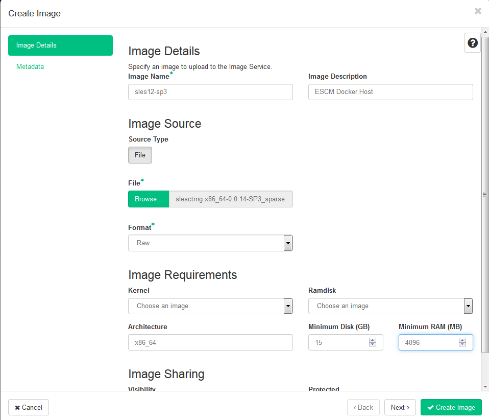
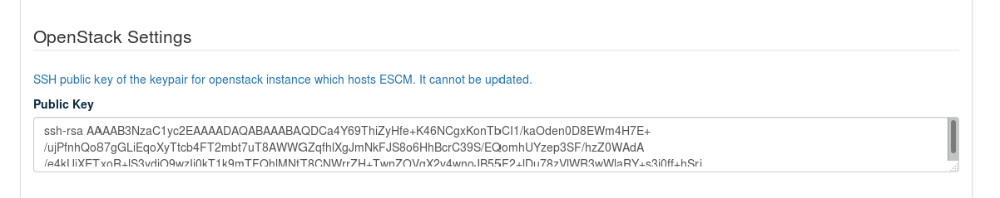
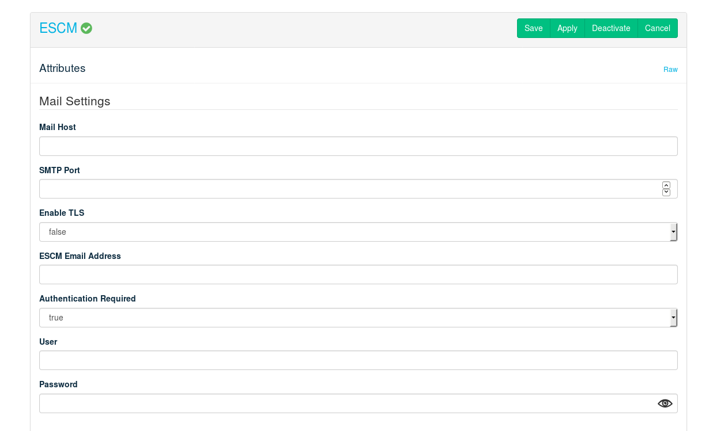
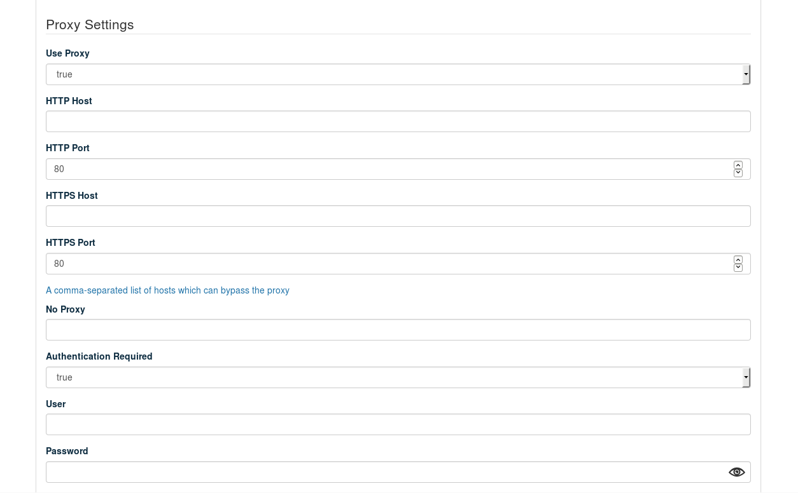
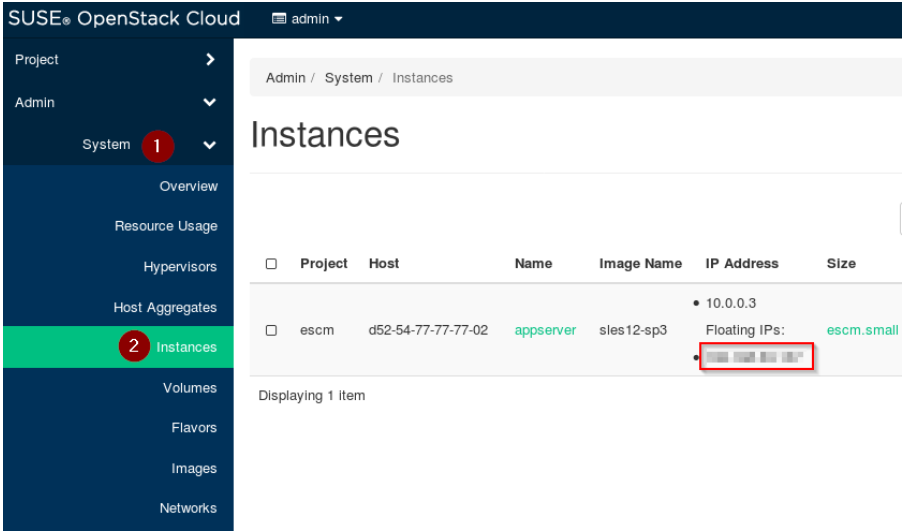

# ESCM Deployment Guide

FUJITSU Software Enterprise Service Catalog Manager (ESCM) is a cloud services management software, licensed as &quot;OpenStack Compatible&quot;. It offers ready-to-use service provisioning adapters for cloud service providers like Amazon Web Services (AWS) and OpenStack, but is also open for integrating other platforms.

The ESCM software is available as Docker images, deployed as a cloud application using Heat templates and configured to interact with the SUSE OpenStack Cloud.

The complete documentation can be found [here](https://github.com/servicecatalog/documentation/blob/ESCM/README.md).

## 1. Prerequisites

#### OpenStack Services

For installing ESCM in SUSE OpenStack Cloud, the following OpenStack services must be already installed and running:

- Keystone
- Nova
- Neutron
- Glance
- Cinder
- Heat

#### SLES Image

The ESCM barclamp expects a SLES image in the Glance image registry of the SUSE OpenStack Cloud. The image must contain Docker and Docker Compose. A ready-to-use image in raw format can be downloaded from [here](https://build.opensuse.org/package/show/isv:fujitsu:fest:Images:slesescm/sles12sp3) and imported in Glance as a public image with the image name ``sles12-sp3``.



#### Network Settings

Be aware that ESCM uses external hosts (mail, proxy, Docker registry) at deployment or run time. Depending on your environment, you can specify an IP address, host name or FQDN for the host setting.

#### Mail Notification

ESCM relies on an external mail server for mail notification. This setting is mandatory.

## 2. ESCM OpenStack Resources

The ESCM barclamp creates instance and volume stacks using predefined Heat templates. The ESCM Docker containers are hosted on the provisioned instance (Docker host) and use Cinder volumes for persisting data (logs and data).

The settings for the Heat templates are not exposed in the barclamp graphical interface, but available only in _Raw_ mode:

 

**OpenStack Settings: Public Key**

An exception is the public part of the OpenStack SSH keypair for accessing the instance. The keypair is available in the graphical interface. An OpenStack SSH keypair with the specified public part will be created and assigned to the instance, so you can access it later using the corresponding private key. Setting a public key is mandatory.



To generate a public key: 
1. Login to the admin node of your SUSE OpenStack Cloud installation. 
2. Run ```cat ~/.ssh/id_rsa.pub```
3. Copy everything from root in the base system to the barclamp graphical interface.


## 3. ESCM Settings

The ESCM settings are specified in the barclamp graphical interface (_Custom_ mode).

#### Mail Settings

**Mail Host** : Host of the mail server to be used. This setting is mandatory. 

**SMTP Port** : SMTP port of the mail server.

**Enable TLS** : true if the mail server requires a secure connection, false otherwise. 

**ESCM Email Address** : The email address used by ESCM for sending email notifications.

**Authentication Required** : true if the mail server requires authentication, false otherwise. 

**User** : User name for SMTP authentication

**Password** : Password for SMTP authentication




#### Docker Registry

By default, DockerHub is configured as the registry for the ESCM software. If it is required to use a custom registry, you can specify its configuration. Depending on the registry, authentication can also be configured.

**Use Docker Hub** : true if you use the official ESCM Docker images as provided on DockerHub, false otherwise.

**Authentication Required** : true if the registry requires authentication or if you want to use authentication, false otherwise.

**User** : User name for registry authentication

**Password** : Password for registry authentication

**Organization** : Relevant only when using a custom registry. Specifies the organization which contains the ESCM images in the registry.

**Registry Host** : Docker registry host

**Registry Port** : Docker registry port


#### Proxy Settings

Depending on your environment, it may be necessary to specify proxy settings for the OpenStack instance hosting the ESCM Docker images.

These settings are used for the Docker engine environment which needs access to the Docker registry as well as for the ESCM Docker containers which access the Internet.

**HTTP Proxy Host** : The HTTP proxy host

**HTTP Proxy Port** : The HTTP proxy port

**HTTPS Proxy Host** : The HTTPS proxy host

**HTTPS Proxy Port** : The HTTPS proxy port

**No Proxy** : Host names, IP addresses, or FQDNs for which the proxy should be bypassed in a comma-separated list. By default, this list already contains localhost, 127.0.0.1 and the floating IP address of the ESCM instance. Specify additional ones, if necessary.

**Authentication Required** : true if the proxy server requires authentication, false otherwise

**User** : User name for proxy authentication

**Password** : Password for proxy authentication



#### SSL Settings

You must specify the locations for the certificate key pair files which the application will use for its HTTPS listeners. Note that both trusted and self-signed certificates are accepted.

**Protocol** : HTTPS (ESCM always uses HTTPS)

**Generate self-signed certificates** : true if you want the system to automatically generate and use self-signed certificates, false if you want to provide your own certificate and key files.

**Host FQDN/IP address** : If you leave this field empty, certificates will be automatically generated with the floating IP address of the ESCM instance as the Common Name. You can override the floating IP address with your own IP address or host name.

**SSL Certificate File** : Location of your SSL public certificate file on the OpenStack Control Node, if you wish to provide your own. The certificate must be in PEM format.

**SSL Private Key File** : Location of your SSL private key file on the OpenStack Control Node, if you wish to provide your own. The file must be in PEM format.

**SSL CA Certificates File** : Location of your SSL intermediates certificate (&quot;chain&quot;) file on the OpenStack Control Node, if you wish to provide your own. The certificate must be in PEM format. This setting is optional.


## 4. Operations and Troubleshooting

After having applied the ESCM proposal, it may take some minutes until the ESCM services are available on the selected compute node, although a message might be displayed that ESCM has been deployed successfully. You may log in to the ESCM instance where the ESCM containers are running at any time, either to do operational tasks or to check the status. You may use the floating IP of the instance and the OpenStack SSH public key you provided.

#### How to Access the ESCM Instance

Open the OpenStack Dashboard on your control node and navigate to **System -> Instances**. There you will see the deployed ESCM instance. Note its Floating IP address.



You may connect to this Floating IP address via SSH, using the SSH public key you specified when you provisioned the ESCM barclamp.
```
ssh root@<floating_ip>
```

#### Where to Find the ESCM Logs

The deployment logs are in two log files: 
1. ESCM instance setup log: 	`/var/log/setup-cloud.log`
2. ESCM container setup log: `/docker/logs/setup-machine-<date>.log` (rotated daily)

The main application logs are saved to separate log files, depending on the Docker container the respective component runs in. In general the log file location is: 

`/docker/logs/<container name>/<container name>.out.log`

Below is a list of main component log files: 

- Database: `/docker/logs/oscm-db/oscm-db.out.log`
- ESCM CORE: `/docker/logs/oscm-core/oscm-core.out.log`
- ESCM APP: `/docker/logs/oscm-app/oscm-app.out.log`
- ESCM Reporting:`/docker/logs/oscm-birt/oscm-birt.out.log`
- Branding: `/docker/logs/oscm-branding/oscm-branding.out.log`
- Online help: `/docker/logs/oscm-help/oscm-help.out.log`

For advanced troubleshooting, it can be necessary to check additional application server (Tomcat) logs. They can be found in the following directories: 

- ESCM CORE: `/docker/logs/oscm-core/tomcat`
- ESCM APP: `/docker/logs/oscm-app/tomcat`
- ESCM Reporting: `/docker/logs/oscm-birt/tomcat`

### How to Backup/Restore the ESCM Databases

Below you find example procedures. 

#### Backup
```
# Access the ESCM instance via SSH
ssh root@<floating_ip>

# Access the ESCM configuration file and note the database superuser password
less /docker/var.env
# -> DB_SUPERPWD=<random string>

# Create a directory to hold the database backups
mkdir /docker/data/backup

# Start a temporary Docker container with access to the database from which you can create the backups
# Note: If you use a custom Docker registry, please substitute the 
# servicecatalog/oscm-db:latest image name with your image name.
# You may list the local image names with the command 'docker images'
docker run -it --name dbbackup --rm --network docker_default -v /docker/data/backup:/backup servicecatalog/oscm-db:latest /bin/bash

# Export the database superuser password in the environment
export PGPASSWORD="<your DB_SUPERPWD>"

# Create the SQL dump backups
pg_dumpall -g -c --if-exists -f /backup/globals.sql -h oscm-db -U postgres
pg_dump -c --if-exists -C --quote-all-identifiers -f /backup/bss.sql -h oscm-db -U postgres bss
pg_dump -c --if-exists -C --quote-all-identifiers -f /backup/bssapp.sql -h oscm-db -U postgres bssapp
pg_dump -c --if-exists -C --quote-all-identifiers -f /backup/bssjms.sql -h oscm-db -U postgres bssjms

# Exit the temporary Docker container
exit
```

#### Restore

```
# Access the ESCM instance via SSH
ssh root@<floating_ip>

# Access the ESCM configuration file and note the database superuser password
less /docker/var.env
# -> DB_SUPERPWD=<random string>

# Enter the Docker Compose directory
cd /docker

# Stop and remove any running containers
docker-compose -f docker-compose-oscm.yml stop
docker-compose -f docker-compose-oscm.yml rm -f

# Optional: Completely delete the existing database
rm -rf /docker/data/oscm-db/data ; mkdir /docker/data/oscm-db/data

# Start only the database Docker container
docker-compose -f docker-compose-oscm.yml up -d oscm-db

# Start a temporary Docker container with access to the database from which you can create the backups.
# Note: If you use a custom Docker registry, please substitute the 
# servicecatalog/oscm-db:latest image name with your image name.
# You may list the local image names with the command 'docker images'
docker run -it --name dbrestore --rm --network docker_default -v /docker/data/backup:/backup servicecatalog/oscm-db:latest /bin/bash

# Export the database superuser password in the environment
export PGPASSWORD="<your DB_SUPERPWD>"

# Restore the SQL dump backups
psql -h oscm-db -U postgres < /backup/globals.sql
psql -h oscm-db -U postgres < /backup/bss.sql
psql -h oscm-db -U postgres < /backup/bssapp.sql
psql -h oscm-db -U postgres < /backup/bssjms.sql

# Exit the temporary Docker container
exit

# Enter the Docker Compose directory
cd /docker

# Start all application Docker containers
docker-compose -f docker-compose-oscm.yml up -d

```
